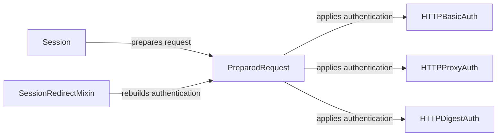

## Component Details

The Authentication Manager in the `requests` library provides a flexible and extensible way to handle various authentication schemes when making HTTP requests. It encapsulates the logic for adding authentication headers to requests, handling authentication challenges, and managing authentication state across multiple requests. The core components include authentication handlers for Basic and Digest authentication, as well as the `Session` and `PreparedRequest` objects that orchestrate the authentication process.

### HTTPBasicAuth
Handles HTTP Basic Authentication by encoding the username and password in base64 and adding it to the 'Authorization' header. It's a simple authentication scheme suitable for trusted environments.
- **Related Classes/Methods**: `requests.src.requests.auth.HTTPBasicAuth:__call__` (94:96)

### HTTPProxyAuth
Handles HTTP Proxy Authentication by encoding the username and password for the proxy in base64 and adding it to the 'Proxy-Authorization' header. This is used when connecting to a server through a proxy that requires authentication.
- **Related Classes/Methods**: `requests.src.requests.auth.HTTPProxyAuth:__call__` (102:104)

### HTTPDigestAuth
Handles HTTP Digest Authentication, a more complex scheme that involves a challenge-response mechanism. It manages the authentication flow, generates the digest header, handles 401 responses, and retries the request with the correct authentication information. It interacts with the server multiple times to complete the authentication process.
- **Related Classes/Methods**: `requests.src.requests.auth.HTTPDigestAuth:build_digest_header` (126:234), `requests.src.requests.auth.HTTPDigestAuth:handle_401` (241:283), `requests.src.requests.auth.HTTPDigestAuth:__call__` (285:303)

### PreparedRequest
Represents a prepared request, ready to be sent. The `prepare_auth` method applies the authentication to the request based on the provided authentication handler. It acts as an intermediary, taking the authentication handler and applying it to the request before it's sent.
- **Related Classes/Methods**: `requests.src.requests.models.PreparedRequest:prepare_auth` (588:608)

### Session
Manages and persists request parameters across multiple requests. The `prepare_request` method prepares the request, which includes applying authentication via the `PreparedRequest` object. It maintains cookies and other session-related data, and it's responsible for preparing the request with the appropriate authentication information.
- **Related Classes/Methods**: `requests.src.requests.sessions.Session:prepare_request` (457:498)

### SessionRedirectMixin
A mixin class that provides methods for handling redirects within a Session. The `rebuild_auth` method is responsible for re-applying authentication information when following redirects, if necessary. This ensures that authentication is maintained even when the server redirects the request.
- **Related Classes/Methods**: `requests.src.requests.sessions.SessionRedirectMixin:rebuild_auth` (282:300)