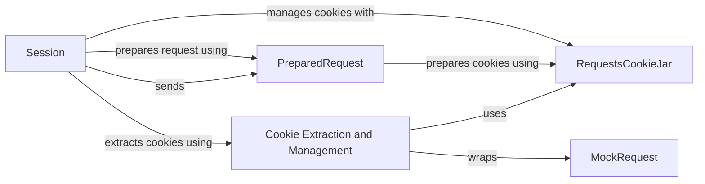

## Component Details

The Cookie Jar component in the `requests` library is responsible for managing HTTP cookies across multiple requests within a session. It handles the extraction, storage, and sending of cookies, ensuring that session state is maintained. The core of this component is the `RequestsCookieJar`, a dictionary-like container for storing cookies. The `Session` object utilizes the `Cookie Jar` to persist cookies between requests. When a request is prepared by `PreparedRequest`, cookies are retrieved from the `RequestsCookieJar` and added to the request headers. Upon receiving a response, cookies are extracted and merged into the `RequestsCookieJar`, updating the session's cookie state.

### Session
The Session class manages and persists session settings, including cookies, across multiple requests. It prepares requests, sends them, handles redirects, and updates the cookie jar with cookies received in responses.
- **Related Classes/Methods**: `requests.src.requests.sessions.Session` (356:816), `requests.src.requests.sessions.Session:prepare_request` (457:498), `requests.src.requests.sessions.Session:send` (673:748)

### PreparedRequest
The PreparedRequest class represents a request that is ready to be sent. It encodes the request method, URL, headers, and body. It also prepares the cookies by retrieving them from the RequestsCookieJar and adding them to the request headers.
- **Related Classes/Methods**: `requests.src.requests.models.PreparedRequest` (313:637), `requests.src.requests.models.PreparedRequest:prepare_cookies` (610:628)

### RequestsCookieJar
The RequestsCookieJar class is a dictionary-like container for storing HTTP cookies. It provides methods for setting, getting, and deleting cookies, and supports domain and path matching. It is used by the Session class to persist cookies across requests.
- **Related Classes/Methods**: `requests.src.requests.cookies.RequestsCookieJar` (176:437), `requests.src.requests.cookies.RequestsCookieJar:get` (194:204), `requests.src.requests.cookies.RequestsCookieJar:set` (206:223), `requests.src.requests.cookies.RequestsCookieJar:keys` (234:240), `requests.src.requests.cookies.RequestsCookieJar:values` (251:257), `requests.src.requests.cookies.RequestsCookieJar:items` (268:275), `requests.src.requests.cookies.RequestsCookieJar:__getitem__` (327:334), `requests.src.requests.cookies.RequestsCookieJar:__setitem__` (336:341), `requests.src.requests.cookies.RequestsCookieJar:__delitem__` (343:347), `requests.src.requests.cookies.RequestsCookieJar:update` (358:364), `requests.src.requests.cookies.RequestsCookieJar:_find_no_duplicates` (386:413), `requests.src.requests.cookies.RequestsCookieJar:copy` (428:433)

### Cookie Extraction and Management
This component includes functions for extracting cookies from responses and merging them into a RequestsCookieJar. It also provides utilities for converting between different cookie representations and adding cookies to a request.
- **Related Classes/Methods**: `requests.src.requests.cookies:extract_cookies_to_jar` (124:137), `requests.src.requests.cookies:get_cookie_header` (140:148), `requests.src.requests.cookies:morsel_to_cookie` (492:518), `requests.src.requests.cookies:cookiejar_from_dict` (521:539), `requests.src.requests.cookies:merge_cookies` (542:561), `requests.src.requests.utils:add_dict_to_cookiejar` (481:489)

### MockRequest
The MockRequest class wraps a requests.Request object to mimic a urllib2.Request, providing the interface expected by http.cookiejar.CookieJar for managing cookie policies. It is used internally by the cookie management functions.
- **Related Classes/Methods**: `requests.src.requests.cookies.MockRequest` (23:100), `requests.src.requests.cookies.MockRequest:get_origin_req_host` (46:47), `requests.src.requests.cookies.MockRequest:get_full_url` (49:67), `requests.src.requests.cookies.MockRequest:unverifiable` (91:92), `requests.src.requests.cookies.MockRequest:origin_req_host` (95:96), `requests.src.requests.cookies.MockRequest:host` (99:100)