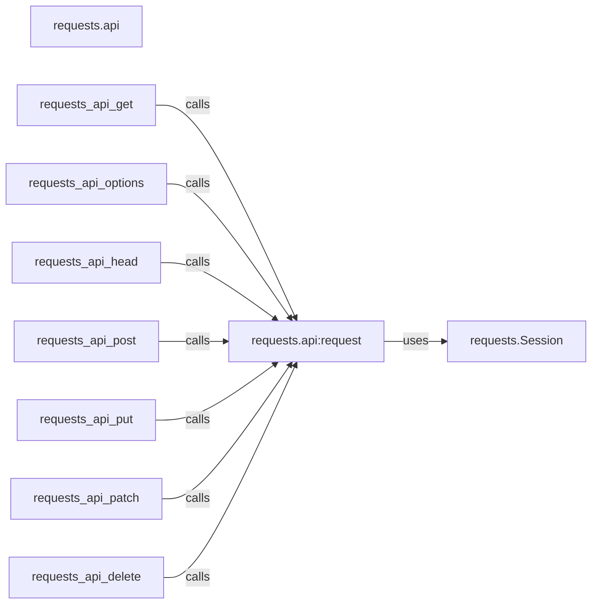

## Component Details

The Requests library provides a high-level API for making HTTP requests. The core of this API resides in the `requests.api` module, which offers convenience functions like `get`, `post`, `put`, `delete`, etc., for various HTTP methods. These functions internally call the `request` function, which serves as the central point for constructing and sending requests using a `Session` object. The `Session` object manages persistent parameters like cookies and connection pooling, optimizing performance and simplifying request handling. The library abstracts away many of the complexities involved in making HTTP requests, providing a clean and intuitive interface for users.

### requests.api
This module provides a high-level interface for making HTTP requests. It defines functions for common HTTP methods like GET, POST, PUT, DELETE, etc. These functions ultimately call the `request` function, which is the core of the API.
- **Related Classes/Methods**: `requests.src.requests.api:request` (14:59), `requests.src.requests.api:get` (62:73), `requests.src.requests.api:options` (76:85), `requests.src.requests.api:head` (88:100), `requests.src.requests.api:post` (103:115), `requests.src.requests.api:put` (118:130), `requests.src.requests.api:patch` (133:145), `requests.src.requests.api:delete` (148:157)

### requests.api:request
This function is the main entry point for making HTTP requests. It takes the HTTP method, URL, and optional parameters like headers, data, and cookies. It prepares the request and sends it using a Session object.
- **Related Classes/Methods**: `requests.src.requests.api:request` (14:59)

### requests.Session
The Session object manages persistent parameters across requests, such as cookies and connection pooling. It provides methods for making HTTP requests with these persistent parameters. It is used by the `requests.api:request` to send the request.
- **Related Classes/Methods**: `requests.src.requests.Session` (full file reference)