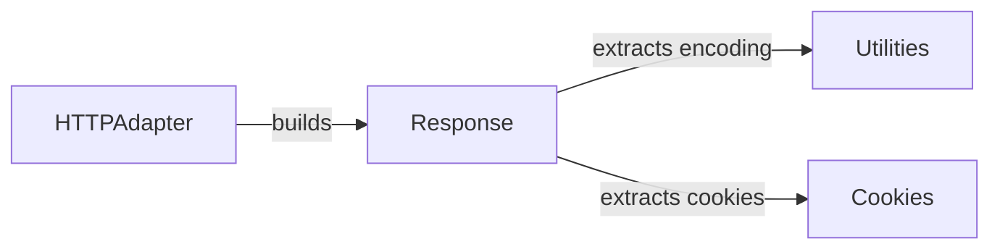

## Component Details

The Response Handling subsystem in the `requests` library is responsible for taking the raw HTTP response from the server and transforming it into a usable `Response` object. This involves decoding the content, handling cookies, checking for errors, and providing convenient access to the response data (body, headers, etc.). The core components involved are the `HTTPAdapter` (which builds the initial response), the `Response` object itself (which stores the response data and provides methods for accessing it), the `Utilities` module (which provides encoding and decoding functions), and the `Cookies` module (which handles cookie extraction and storage).

### HTTPAdapter
The HTTPAdapter class is responsible for handling the actual communication with the server. It sends the HTTP request and receives the raw HTTP response. A key part of its responsibility is to build the `Response` object from this raw data.
- **Related Classes/Methods**: `requests.src.requests.adapters.HTTPAdapter:build_response` (359:394)

### Response
The Response class encapsulates the server's response. It stores the status code, headers, and content of the response. It also provides methods to access the content in various formats (text, JSON) and to check for errors. The Response object uses the Utilities module to decode the content and the Cookies module to extract cookies.
- **Related Classes/Methods**: `requests.src.requests.models.Response:__init__` (658:703), `requests.src.requests.models.Response:__exit__` (708:709), `requests.src.requests.models.Response:__iter__` (750:752), `requests.src.requests.models.Response:ok` (755:767), `requests.src.requests.models.Response:iter_content` (799:855), `requests.src.requests.models.Response:iter_lines` (857:888), `requests.src.requests.models.Response:content` (891:907), `requests.src.requests.models.Response:json` (947:980), `requests.src.requests.models.Response:links` (983:997), `requests.src.requests.models.Response:raise_for_status` (999:1026)

### Utilities
The Utilities module provides helper functions for tasks such as determining the encoding of the response and decoding the response body to Unicode. These utilities are used by the Response object to handle different character encodings.
- **Related Classes/Methods**: `requests.src.requests.utils:get_encoding_from_headers` (542:564), `requests.src.requests.utils:get_unicode_from_response` (594:630)

### Cookies
The Cookies module is responsible for extracting cookies from the response headers and storing them in a cookie jar. This allows the client to maintain state across multiple requests.
- **Related Classes/Methods**: `requests.src.requests.cookies:extract_cookies_to_jar` (124:137)