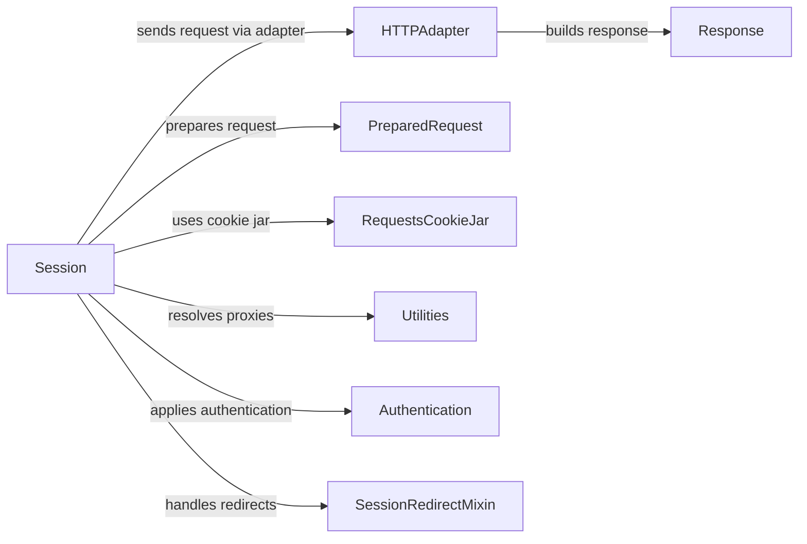

## Component Details

The Session Manager in the `requests` library provides a way to manage HTTP sessions, including connection pooling, cookie persistence, and default configurations. The central component is the `Session` class, which handles the creation, configuration, and execution of HTTP requests. It interacts with `HTTPAdapter` to send requests, `PreparedRequest` to structure requests, `Response` to interpret server replies, `RequestsCookieJar` for cookie management, `Utilities` for helper functions, `Authentication` for handling authentication, and `SessionRedirectMixin` for managing redirects.

### Session
The Session class provides cookie persistence, connection-pooling, and configuration. It's the central point for making requests. It handles preparing requests, sending them through adapters, and applying redirects.
- **Related Classes/Methods**: `requests.src.requests.sessions.Session:__init__` (390:449), `requests.src.requests.sessions.Session:__exit__` (454:455), `requests.src.requests.sessions.Session:prepare_request` (457:498), `requests.src.requests.sessions.Session:request` (500:591), `requests.src.requests.sessions.Session:get` (593:602), `requests.src.requests.sessions.Session:options` (604:613), `requests.src.requests.sessions.Session:head` (615:624), `requests.src.requests.sessions.Session:post` (626:637), `requests.src.requests.sessions.Session:put` (639:649), `requests.src.requests.sessions.Session:patch` (651:661), `requests.src.requests.sessions.Session:delete` (663:671), `requests.src.requests.sessions.Session:send` (673:748), `requests.src.requests.sessions.Session:merge_environment_settings` (750:779), `requests.src.requests.sessions.Session:get_adapter` (781:792)

### HTTPAdapter
The HTTPAdapter class is responsible for handling the actual sending of HTTP requests. It uses connection pools for efficiency and handles proxy settings. It builds responses from the server's reply.
- **Related Classes/Methods**: `requests.src.requests.adapters.HTTPAdapter:__init__` (202:222), `requests.src.requests.adapters.HTTPAdapter:__setstate__` (227:238), `requests.src.requests.adapters.HTTPAdapter:proxy_manager_for` (266:302), `requests.src.requests.adapters.HTTPAdapter:build_response` (359:394), `requests.src.requests.adapters.HTTPAdapter:build_connection_pool_key_attributes` (396:444), `requests.src.requests.adapters.HTTPAdapter:get_connection_with_tls_context` (446:493), `requests.src.requests.adapters.HTTPAdapter:get_connection` (495:534), `requests.src.requests.adapters.HTTPAdapter:request_url` (546:576), `requests.src.requests.adapters.HTTPAdapter:proxy_headers` (592:611), `requests.src.requests.adapters.HTTPAdapter:send` (613:719)

### PreparedRequest
The PreparedRequest class represents a request that has been prepared for transmission. It contains all the necessary information, such as headers, body, and URL, in a format suitable for sending.
- **Related Classes/Methods**: `requests.src.requests.models.PreparedRequest:prepare` (351:377)

### Response
The Response class encapsulates the server's response to an HTTP request. It contains the response body, headers, status code, and other relevant information.
- **Related Classes/Methods**: `requests.src.requests.models.Response:__init__` (658:703)

### RequestsCookieJar
The RequestsCookieJar class is a cookie jar that stores HTTP cookies. It provides methods for getting, setting, and deleting cookies.
- **Related Classes/Methods**: `requests.src.requests.cookies.RequestsCookieJar:get` (194:204), `requests.src.requests.cookies.RequestsCookieJar:set` (206:223), `requests.src.requests.cookies.RequestsCookieJar:keys` (234:240), `requests.src.requests.cookies.RequestsCookieJar:values` (251:257), `requests.src.requests.cookies.RequestsCookieJar:items` (268:275), `requests.src.requests.cookies.RequestsCookieJar:__getitem__` (327:334), `requests.src.requests.cookies.RequestsCookieJar:__setitem__` (336:341), `requests.src.requests.cookies.RequestsCookieJar:__delitem__` (343:347), `requests.src.requests.cookies.RequestsCookieJar:update` (358:364), `requests.src.requests.cookies.RequestsCookieJar:_find_no_duplicates` (386:413), `requests.src.requests.cookies.RequestsCookieJar:copy` (428:433), `requests.src.requests.cookies:cookiejar_from_dict` (521:539), `requests.src.requests.cookies:merge_cookies` (542:561)

### Utilities
The utilities module provides helper functions for various tasks, such as encoding detection, proxy resolution, and default header generation.
- **Related Classes/Methods**: `requests.src.requests.utils:get_encoding_from_headers` (542:564), `requests.src.requests.utils:get_unicode_from_response` (594:630), `requests.src.requests.utils:resolve_proxies` (867:891), `requests.src.requests.utils:default_headers` (903:914)

### Authentication
The authentication module provides classes for handling different types of HTTP authentication, such as basic, proxy, and digest authentication.
- **Related Classes/Methods**: `requests.src.requests.auth.HTTPBasicAuth:__call__` (94:96), `requests.src.requests.auth.HTTPProxyAuth:__call__` (102:104), `requests.src.requests.auth.HTTPDigestAuth:build_digest_header` (126:234), `requests.src.requests.auth.HTTPDigestAuth:handle_401` (241:283), `requests.src.requests.auth.HTTPDigestAuth:__call__` (285:303)

### SessionRedirectMixin
The SessionRedirectMixin provides functionality for handling HTTP redirects within a session.
- **Related Classes/Methods**: `requests.src.requests.sessions.SessionRedirectMixin:get_redirect_target` (107:125), `requests.src.requests.sessions.SessionRedirectMixin:resolve_redirects` (159:280), `requests.src.requests.sessions.SessionRedirectMixin:rebuild_auth` (282:300), `requests.src.requests.sessions.SessionRedirectMixin:rebuild_proxies` (302:331)