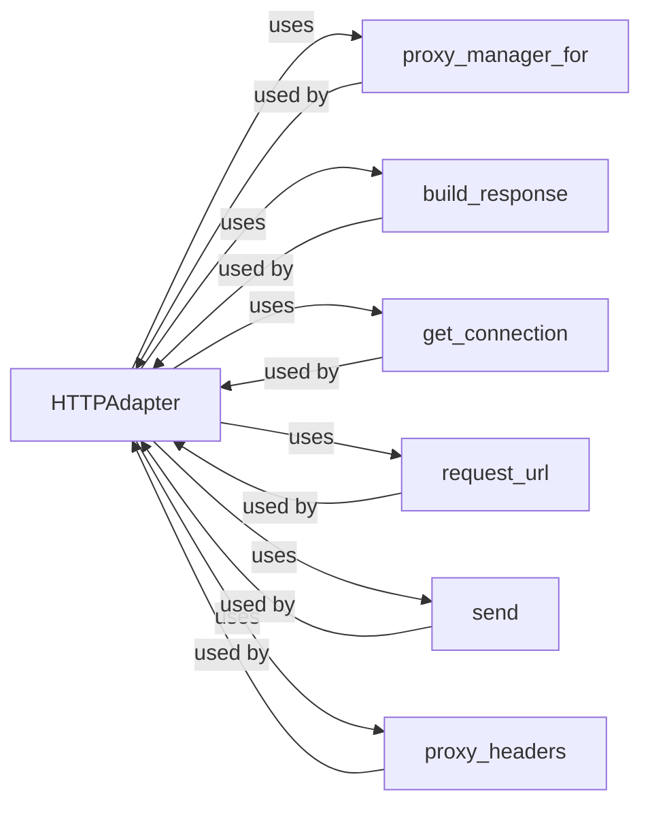

## Component Details

The Transport Adapter component, embodied primarily by the HTTPAdapter class, manages the communication between the requests library and the underlying network protocols (HTTP/HTTPS). It handles connection pooling, proxy settings, and SSL/TLS verification. The adapter translates the abstract PreparedRequest objects into concrete network requests, manages connections (including establishing new ones and reusing existing ones), and constructs Response objects from the received data. It provides a consistent interface for sending requests regardless of the specific protocol or network configuration.

### HTTPAdapter
The HTTPAdapter class provides a connection pooling and re-use mechanism for HTTP and HTTPS requests. It handles the low-level details of establishing and managing connections to web servers, including proxy support and TLS configuration. It adapts the `requests` library to different transport mechanisms.
- **Related Classes/Methods**: `requests.src.requests.adapters.HTTPAdapter` (167:719), `requests.src.requests.adapters.HTTPAdapter:__init__` (202:222), `requests.src.requests.adapters.HTTPAdapter:send` (613:719), `requests.src.requests.adapters.HTTPAdapter:get_connection` (495:534)

### proxy_manager_for
This method returns a proxy manager for a given proxy URL. It is responsible for creating and configuring the connection pool for the proxy server. It uses the proxy URL to determine the appropriate proxy adapter to use.
- **Related Classes/Methods**: `requests.src.requests.adapters.HTTPAdapter:proxy_manager_for` (266:302)

### build_response
This method constructs a Response object from the HTTP response received from the server. It parses the headers, content, and status code to create a user-friendly representation of the response. It handles potential encoding issues and prepares the response for consumption by the user.
- **Related Classes/Methods**: `requests.src.requests.adapters.HTTPAdapter:build_response` (359:394)

### get_connection
This method retrieves a connection from the pool or establishes a new connection to the server. It handles connection pooling and TLS configuration. It uses the urllib3 library to manage the actual connections.
- **Related Classes/Methods**: `requests.src.requests.adapters.HTTPAdapter:get_connection` (495:534)

### request_url
This method prepares the URL for the request, ensuring it is properly formatted and encoded. It might modify the URL based on the request parameters.
- **Related Classes/Methods**: `requests.src.requests.adapters.HTTPAdapter:request_url` (546:576)

### send
This method sends the HTTP request to the server using the established connection. It handles the actual transmission of data and receives the response. It also deals with stream handling and redirects.
- **Related Classes/Methods**: `requests.src.requests.adapters.HTTPAdapter:send` (613:719)

### proxy_headers
This method prepares the headers for the request, adding any necessary proxy-related headers. It ensures that the request is properly routed through the proxy server.
- **Related Classes/Methods**: `requests.src.requests.adapters.HTTPAdapter:proxy_headers` (592:611)