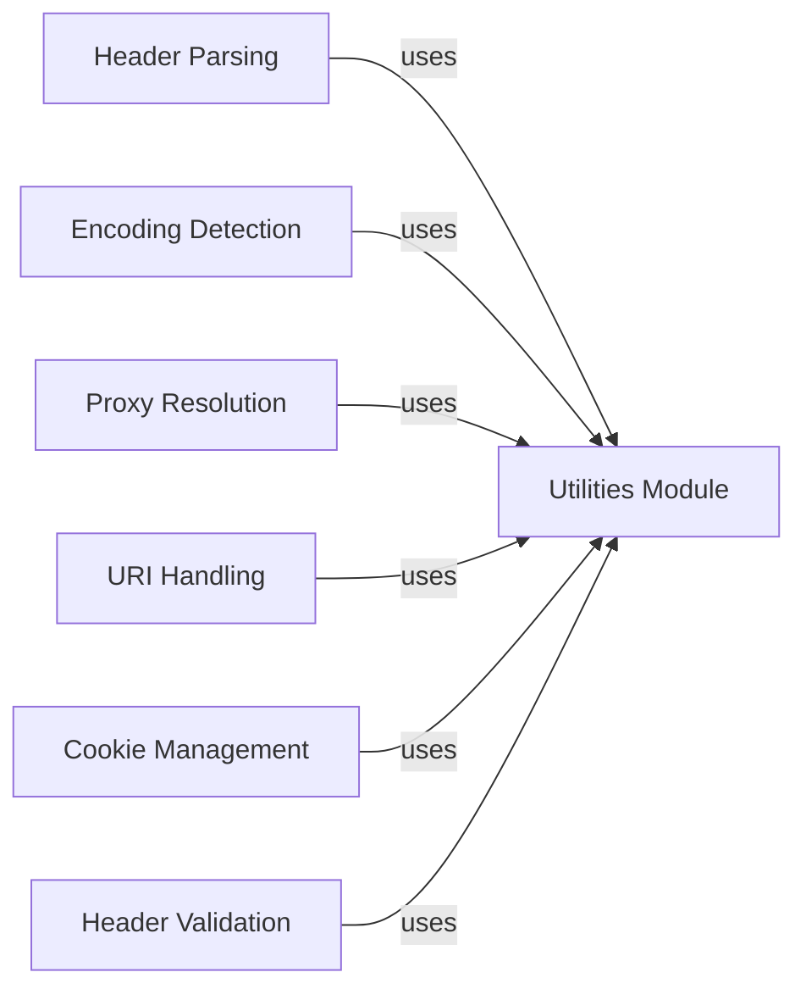

## Component Details

The Utilities module in the requests library provides a collection of helper functions that support various aspects of making HTTP requests. These utilities handle tasks such as parsing headers, managing proxies, detecting encodings, and manipulating URIs. By centralizing these functionalities, the Utilities module promotes code reuse and ensures consistency across the library.

### Utilities Module
This module serves as a central repository for utility functions used throughout the requests library. It includes functions for header parsing, proxy resolution, encoding detection, URI handling, cookie management, and header validation. These utilities provide essential support for other components in the library.
- **Related Classes/Methods**: `requests.src.requests.utils:extract_zipped_paths` (271:305), `requests.src.requests.utils:parse_list_header` (378:406), `requests.src.requests.utils:parse_dict_header` (410:441), `requests.src.requests.utils:add_dict_to_cookiejar` (481:489), `requests.src.requests.utils:get_encoding_from_headers` (542:564), `requests.src.requests.utils:get_unicode_from_response` (594:630), `requests.src.requests.utils:unquote_unreserved` (639:660), `requests.src.requests.utils:requote_uri` (663:682), `requests.src.requests.utils:address_in_network` (685:697), `requests.src.requests.utils:should_bypass_proxies` (768:826), `requests.src.requests.utils:get_environ_proxies` (829:838), `requests.src.requests.utils:resolve_proxies` (867:891), `requests.src.requests.utils:default_headers` (903:914), `requests.src.requests.utils:check_header_validity` (1037:1045), `requests.src.requests.utils:_validate_header_part` (1048:1064), `requests.src.requests.utils:rewind_body` (1084:1099)

### Header Parsing
This component provides functions to parse HTTP headers, including both list and dictionary formats. It extracts and interprets header values, which are crucial for processing HTTP requests and responses. The component ensures that headers are correctly formatted and that their values are properly extracted for use within the library.
- **Related Classes/Methods**: `requests.src.requests.utils:parse_list_header` (378:406), `requests.src.requests.utils:parse_dict_header` (410:441)

### Encoding Detection
This component is responsible for detecting the encoding of HTTP responses. It examines headers and the response body to determine the correct encoding, allowing the library to properly decode the content. This is crucial for handling responses with different character sets and ensuring that text data is correctly interpreted.
- **Related Classes/Methods**: `requests.src.requests.utils:get_encoding_from_headers` (542:564), `requests.src.requests.utils:get_unicode_from_response` (594:630)

### Proxy Resolution
This component handles the resolution of proxies for making HTTP requests. It determines whether a proxy should be used for a given request based on the target address and environment variables. It also provides functions to retrieve proxy settings from the environment, allowing the library to adapt to different network configurations.
- **Related Classes/Methods**: `requests.src.requests.utils:should_bypass_proxies` (768:826), `requests.src.requests.utils:get_environ_proxies` (829:838), `requests.src.requests.utils:resolve_proxies` (867:891)

### URI Handling
This component provides utilities for encoding and decoding URIs. It includes functions for unquoting reserved characters and re-encoding URIs to ensure they are properly formatted for HTTP requests. This is important for handling URLs with special characters and ensuring that they are correctly interpreted by the server.
- **Related Classes/Methods**: `requests.src.requests.utils:unquote_unreserved` (639:660), `requests.src.requests.utils:requote_uri` (663:682)

### Cookie Management
This component provides functionality to add dictionaries to cookie jars. It allows the library to manage cookies effectively, storing and retrieving them as needed for different requests. This is essential for maintaining session state and handling user authentication.
- **Related Classes/Methods**: `requests.src.requests.utils:add_dict_to_cookiejar` (481:489)

### Header Validation
This component validates HTTP headers to ensure they conform to the expected format. It checks the validity of header parts and ensures that headers are properly constructed. This helps prevent errors and security vulnerabilities related to malformed headers.
- **Related Classes/Methods**: `requests.src.requests.utils:check_header_validity` (1037:1045), `requests.src.requests.utils:_validate_header_part` (1048:1064)