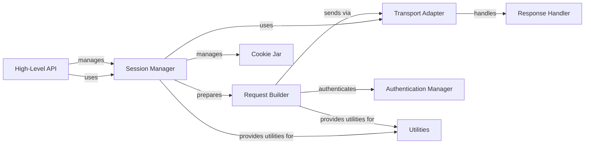

## Component Details

The Requests library provides a high-level interface for making HTTP requests, abstracting away the complexities of underlying network protocols. It offers a session management system for handling persistent connections and cookies, request preparation for constructing and encoding requests, transport adapters for sending requests over different protocols, and response handling for parsing and processing server responses. The library also includes authentication mechanisms and utility functions to support various aspects of the request-response cycle.

### Session Manager
The Session Manager component is responsible for creating and managing sessions, which handle connection pooling, cookie persistence, and default configurations for requests. It acts as a central point for configuring and maintaining HTTP sessions, allowing users to make multiple requests with consistent settings. It also manages the lifecycle of adapters.
- **Related Classes/Methods**: `requests.src.requests.sessions.Session:__init__` (390:449), `requests.src.requests.sessions.Session:__exit__` (454:455), `requests.src.requests.sessions.Session:request` (500:591), `requests.src.requests.sessions.Session:get_adapter` (781:792)

### Request Builder
The Request Builder component constructs and prepares HTTP requests. It takes parameters like URL, headers, and data, and transforms them into a PreparedRequest object, ready for transmission. It handles URL encoding, header construction, and body serialization, ensuring that the request is properly formatted before being sent.
- **Related Classes/Methods**: `requests.src.requests.models.Request:__init__` (258:290), `requests.src.requests.models.Request:prepare` (295:310), `requests.src.requests.models.PreparedRequest:__init__` (334:349), `requests.src.requests.models.PreparedRequest:prepare` (351:377)

### Transport Adapter
The Transport Adapter component is responsible for sending PreparedRequest objects using different transport protocols. It manages connection pooling, proxy settings, and SSL/TLS verification. It adapts the request to the underlying network transport, providing a consistent interface for sending requests regardless of the protocol used.
- **Related Classes/Methods**: `requests.src.requests.adapters.HTTPAdapter:__init__` (202:222), `requests.src.requests.adapters.HTTPAdapter:send` (613:719), `requests.src.requests.adapters.HTTPAdapter:get_connection` (495:534)

### Response Handler
The Response Handler component processes the HTTP response received from the server. It handles content decoding, error checking, and provides access to the response body, headers, and cookies. It transforms the raw response into a usable Response object, making it easy to access and manipulate the response data.
- **Related Classes/Methods**: `requests.src.requests.models.Response:__init__` (658:703), `requests.src.requests.models.Response:content` (891:907), `requests.src.requests.models.Response:json` (947:980), `requests.src.requests.models.Response:raise_for_status` (999:1026)

### Authentication Manager
The Authentication Manager component provides authentication mechanisms for requests. It handles different authentication schemes like Basic and Digest authentication, adding the necessary headers to authenticate requests with the server. It ensures that requests are properly authenticated before being sent, providing a secure way to access protected resources.
- **Related Classes/Methods**: `requests.src.requests.auth.HTTPBasicAuth:__call__` (94:96), `requests.src.requests.auth.HTTPDigestAuth:__call__` (285:303)

### Cookie Jar
The Cookie Jar component manages cookies for the session. It extracts, stores, and sends cookies with requests, maintaining session state across multiple requests. It provides a RequestsCookieJar to store and manage cookies, ensuring that cookies are properly handled throughout the session.
- **Related Classes/Methods**: `requests.src.requests.cookies.RequestsCookieJar:set` (206:223), `requests.src.requests.cookies.RequestsCookieJar:get` (194:204), `requests.src.requests.cookies:extract_cookies_to_jar` (124:137)

### Utilities
The Utilities component provides helper functions for various tasks within the library. It includes functions for URL manipulation, header parsing, proxy resolution, and encoding detection. These utilities support the other components in performing their tasks, providing essential functionality for the library as a whole.
- **Related Classes/Methods**: `requests.src.requests.utils:get_encoding_from_headers` (542:564), `requests.src.requests.utils:requote_uri` (663:682), `requests.src.requests.utils:default_headers` (903:914)

### High-Level API
The High-Level API component provides a simplified interface for making HTTP requests. It offers convenience functions for common HTTP methods like GET, POST, PUT, and DELETE, abstracting away the complexities of session management and request preparation. It serves as the primary entry point for users of the library, making it easy to send HTTP requests with minimal code.
- **Related Classes/Methods**: `requests.src.requests.api:request` (14:59), `requests.src.requests.api:get` (62:73), `requests.src.requests.api:post` (103:115)